# DMG_BUILD_SITE.md — Remaining 3.5e DMG Mechanics Build Plan

## 1. Scope

This document tracks every remaining D&D 3.5e **Dungeon Master's Guide** subsystem
that has not yet been implemented in `src/rules_engine/` or `src/ai_sim/`.

**Already shipped (out of scope here):**

| Module | File | Status |
|--------|------|--------|
| Environmental Hazards (Falling, Heat/Cold, Starvation, Poison, Disease) | `src/rules_engine/hazards.py` | ✅ Phase 1 |
| Magic Item Engine (Enhancement, Wondrous Items, Rings) | `src/rules_engine/magic_items.py` | ✅ Phase 2 |

**Remaining scope — this document:**

| Domain | Key DMG Chapters / Tables |
|--------|--------------------------|
| **Environment** | Weather tables (Ch 3), Terrain types, Underwater/Aerial combat modifiers |
| **Objects & Obstacles** | Material Hardness & HP (Ch 3), Break DCs, Portcullis/Door stats |
| **Traps** | Search/Disable DCs, Trigger/Reset types, Mechanical & Magical trap generators, Trap CR (Ch 4) |
| **Magic Items (Remaining)** | Potions, Scrolls, Wands, Rods, Staffs, Armor/Weapon special abilities, Artifacts (Ch 7–8) |
| **Treasure** | Gems, Art Objects, Hoard tables by CR (Ch 7) |
| **Encounters & XP** | CR/EL formulas, XP distribution matrices, Encounter generator (Ch 2 & App 1) |

---

## 2. Task Tiers

### Tier 0 — Base Schemas & Enums (No Dependencies)

| Task | Title | Subsystem | Requirement | blockedBy | Effort |
|------|-------|-----------|-------------|-----------|--------|
| T-001 | Material Hardness & HP Schema | objects | Dataclass `ObjectMaterial` with `hardness: int`, `hp_per_inch: int`, `break_dc: int`; enum `MaterialType` (Wood, Stone, Iron, Steel, Mithral, Adamantine, Crystal, Rope, Glass) | — | S |
| T-002 | Weather State Enum | environment | Enum `Precipitation` (None/Light/Heavy/Torrential); enum `WindStrength` (Calm/Light/Moderate/Strong/Severe/Windstorm/Hurricane/Tornado); enum `Temperature` (Extreme_Cold/Cold/Temperate/Hot/Extreme_Heat) | — | S |
| T-003 | Terrain Type Enum | environment | Enum `TerrainType` (Dungeon/Forest/Plains/Desert/Hills/Mountains/Marsh/Arctic/Aquatic/Underground/Urban) | — | S |
| T-004 | Trap Component Base Schema | traps | Dataclasses `TrapType` (enum: Mechanical/Magic), `TriggerType` (enum: Location/Proximity/Touch/Sound/Visual/Timed), `ResetType` (enum: NoReset/Repair/Automatic/Manual); `TrapBase` dataclass (slots=True) with `name`, `cr`, `search_dc`, `disable_dc`, `trigger`, `reset` | — | S |
| T-005 | Potion / Scroll / Wand Base Schema | magic-items | Dataclasses `PotionBase`, `ScrollBase`, `WandBase` (slots=True) each with `spell_name`, `caster_level`, `spell_level`, `market_price_gp`; `RodBase` / `StaffBase` with `charges_max`, `market_price_gp` | — | S |
| T-006 | Armor Special Ability Schema | magic-items | Dataclass `ArmorSpecialAbility` (slots=True): `name`, `bonus_equivalent: int`, `aura`, `cl`, `prerequisites`, `market_price_gp: int \| None`; enum `ArmorAbilityType` (Enhancement/Special) | — | S |
| T-007 | Weapon Special Ability Schema | magic-items | Dataclass `WeaponSpecialAbility` (slots=True): `name`, `bonus_equivalent: int`, `aura`, `cl`, `prerequisites`, `market_price_gp: int \| None`; enum `WeaponAbilityType` | — | S |
| T-008 | Gem Grade & Base Value Schema | treasure | Dataclass `GemEntry` (slots=True): `name`, `grade` (enum: Ornamental/Semiprecious/Fancy/Precious/Gemstone/Jewel), `base_value_gp`, `value_range_gp: tuple[int,int]` | — | S |
| T-009 | Art Object Category Schema | treasure | Dataclass `ArtObjectEntry` (slots=True): `name`, `category` (enum: Mundane/Decorated/Masterwork/Exotic), `value_gp`; d%-keyed lookup table (1–100) | — | S |
| T-010 | CR / EL Numeric Base Types | encounters | Dataclass `ChallengeRating` (slots=True): `value: float`; constant lookup `CR_TO_XP: dict[float, int]` (DMG Table 2-1, CR ¼ through CR 30 → XP award); `EncounterLevel` type alias | — | S |
| T-011 | Artifact Schema | magic-items | Dataclass `ArtifactEntry` (slots=True): `name`, `artifact_type` (enum: Minor/Major), `powers: list[str]`, `drawbacks: list[str]`, `lore: str`; market price always `None` (priceless) | — | S |

---

### Tier 1 — Core Mechanics (Depends on Tier 0)

| Task | Title | Subsystem | Requirement | blockedBy | Effort |
|------|-------|-----------|-------------|-----------|--------|
| T-012 | Object Break DC Formula | objects | Function `calculate_break_dc(material: MaterialType, thickness_inches: int, size: SizeCategory) -> int`; applies DMG Table 3-3 modifiers (+5 per inch beyond 1, size modifier); stores result in `ObjectMaterial.break_dc` | T-001 | S |
| T-013 | Object HP & Damage Threshold | objects | Function `apply_damage_to_object(material: MaterialType, hp: int, damage: int, energy_type: DamageType) -> int`; immunity table (Fire vs Wood, Acid vs Metal); half-damage on failed saves; `ObjectState` enum (Intact/Damaged/Broken/Destroyed) | T-001 | M |
| T-014 | Weather Penalty Application | environment | Function `apply_weather_penalties(precip: Precipitation, wind: WindStrength, temp: Temperature) -> WeatherPenalties`; `WeatherPenalties` dataclass: `ranged_attack_penalty: int`, `visibility_ft: int`, `movement_penalty_pct: float`, `listen_penalty: int`, `spot_penalty: int`, `fort_dc_cold: int \| None`, `fort_dc_heat: int \| None`, `fort_dc_wind: int \| None` — values drawn directly from DMG Chapter 3 tables | T-002 | M |
| T-015 | Terrain Movement Cost Table | environment | Function `terrain_movement_cost(terrain: TerrainType, mount: bool) -> float`; returns multiplier (e.g., Mountains = ×2, Marsh = ×2, Desert = ×1); also `terrain_hide_bonus(terrain) -> int` and `terrain_listen_penalty(terrain) -> int` per DMG terrain tables | T-003 | S |
| T-016 | Trap Search DC Resolver | traps | Function `resolve_trap_search(trap: TrapBase, searcher_spot_total: int) -> bool`; passive (10 + Search modifier) vs `trap.search_dc`; `find_trap_active(trap, active_roll) -> bool` for active Search checks | T-004 | S |
| T-017 | Trap Disable DC Resolver | traps | Function `resolve_trap_disable(trap: TrapBase, disable_roll: int) -> DisableResult`; `DisableResult` enum (Disabled/Failed/Triggered); on failure by ≥5: trigger trap; handles Disable Device modifier | T-004 | S |
| T-018 | Potion Market Price Formula | magic-items | Function `potion_market_price(spell_level: int, caster_level: int) -> int`; formula: `spell_level × caster_level × 50 gp` (L0 = ×25 gp); validates `caster_level >= min_caster_level(spell_level)` per DMG p. 285 | T-005 | S |
| T-019 | Scroll Market Price Formula | magic-items | Function `scroll_market_price(spell_level: int, caster_level: int, arcane: bool) -> int`; formula: `spell_level × caster_level × 25 gp` (L0 = 12.5 gp, round up); divine scroll price identical; caster level minimums enforced | T-005 | S |
| T-020 | Wand Market Price Formula | magic-items | Function `wand_market_price(spell_level: int, caster_level: int) -> int`; formula: `spell_level × caster_level × 750 gp` (50 charges); L0 wand = minimum 375 gp | T-005 | S |
| T-021 | Rod/Staff Market Price Formula | magic-items | Function `rod_market_price(rod: RodBase) -> int` and `staff_market_price(staff: StaffBase, primary_spell_level: int, primary_caster_level: int, secondary_costs: list[int]) -> int`; staff formula: `(highest_spell_cost × 2/3) × 50 × cl + sum(secondary × 50 × cl / 5) / 50` per DMG p. 285 | T-005 | M |
| T-022 | Gem Value Randomiser | treasure | Function `roll_gem_value(gem: GemEntry, rng) -> int`; rolls d% within `gem.value_range_gp`; applies ×10 / ×100 multiplier for exceptional rolls (01–10 / 91–100) per DMG Table 7-5 | T-008 | S |
| T-023 | Art Object Value Randomiser | treasure | Function `roll_art_object(rng) -> ArtObjectEntry`; d100 → `ArtObjectEntry` from registry; no sub-roll needed (fixed values per DMG Table 7-6) | T-009 | S |
| T-024 | XP Award per CR Lookup | encounters | Function `xp_for_cr(cr: float, apl: int) -> int`; reads `CR_TO_XP` plus APL offset table (DMG Table 2-2); `apl` = Average Party Level | T-010 | S |
| T-025 | Armor Special Ability Equivalent Bonus Validator | magic-items | Function `validate_armor_ability_stack(base_bonus: int, abilities: list[ArmorSpecialAbility]) -> bool`; total effective bonus (base + sum of bonus_equivalent) must not exceed +10; raises `MagicItemError` if exceeded | T-006 | S |
| T-026 | Weapon Special Ability Equivalent Bonus Validator | magic-items | Function `validate_weapon_ability_stack(base_bonus: int, abilities: list[WeaponSpecialAbility]) -> bool`; same +10 cap rule; ranged weapons exclude melee-only abilities | T-007 | S |

---

### Tier 2 — Registries & Intermediate Generators (Depends on Tier 1)

| Task | Title | Subsystem | Requirement | blockedBy | Effort |
|------|-------|-----------|-------------|-----------|--------|
| T-027 | SRD Potion Registry | magic-items | `POTION_REGISTRY: dict[str, PotionBase]` — 30+ SRD potions priced via `potion_market_price()`: Cure Light/Moderate/Serious Wounds, Bull's Strength, Cat's Grace, Bear's Endurance, Eagle's Splendor, Fox's Cunning, Owl's Wisdom, Barkskin, Darkvision, Hide from Undead, Jump, Neutralize Poison, Remove Blindness/Deafness, Remove Curse, Remove Disease, Remove Fear, Resist Energy, Spider Climb, Water Breathing, Blur, Endure Elements, Gaseous Form, Invisibility, Levitate, Mage Armor, Magic Fang, Nondetection, Protection from Arrows, Shield of Faith | T-018 | M |
| T-028 | SRD Scroll Registry | magic-items | `SCROLL_REGISTRY: dict[str, ScrollBase]` — arcane + divine scrolls across L0–L9; minimum 40 SRD entries per tradition; prices via `scroll_market_price()` | T-019 | M |
| T-029 | SRD Wand Registry | magic-items | `WAND_REGISTRY: dict[str, WandBase]` — 25+ SRD wands: Cure Light Wounds, Fireball, Lightning Bolt, Magic Missile, Charm Person, Hold Person, Invisibility, Knock, Web, Dispel Magic, Bear's Endurance, Bull's Strength, Cat's Grace, Eagle's Splendor, Enervation, Fear, Fly, Haste, Ice Storm, Inflict Light Wounds, Melf's Acid Arrow, Neutralize Poison, Slow, Suggestion, Summon Monster III; prices via `wand_market_price()` | T-020 | M |
| T-030 | SRD Rod Registry | magic-items | `ROD_REGISTRY: dict[str, RodBase]` — 20 SRD rods: Absorption, Alertness, Cancellation, Enemy Detection, Flailing, Flame Extinguishing, Lordly Might, Metal and Mineral Detection, Negation, Python, Rulership, Security, Smiting, Splendor, Thunder and Lightning, Viper, Viscid Globs, Withering, Wonder, Immovable Rod; prices via `rod_market_price()` | T-021 | M |
| T-031 | SRD Staff Registry | magic-items | `STAFF_REGISTRY: dict[str, StaffBase]` — 17 SRD staffs: Abjuration, Charming, Conjuration, Defense, Divination, Earth and Stone, Evocation, Fire, Frost, Healing, Illumination, Illusion, Life, Necromancy, Passage, Power, Size Alteration, Swarming Insects, Transmutation, Woodlands; prices via `staff_market_price()` | T-021 | L |
| T-032 | SRD Armor Special Ability Registry | magic-items | `ARMOR_SPECIAL_ABILITY_REGISTRY: dict[str, ArmorSpecialAbility]` — 16 SRD abilities: Glamered (+1 eq), Fortification Light/Moderate/Heavy (+1/+3/+5 eq), Invulnerability (+3 eq), Reflecting (+5 eq), Shadow (+1 eq), Silent Moves (+1 eq), Slick (+1 eq), Spell Resistance 13/15/17/19 (+2/+3/+4/+5 eq), Etherealness (+6 eq), Undead Controlling (+9 eq) | T-025 | M |
| T-033 | SRD Weapon Special Ability Registry | magic-items | `WEAPON_SPECIAL_ABILITY_REGISTRY: dict[str, WeaponSpecialAbility]` — 25+ SRD abilities: Bane, Defending, Disruption, Distance, Flaming, Flaming Burst, Frost, Holy, Icy Burst, Keen, Ki Focus, Lawful, Merciful, Mighty Cleaving, Returning, Seeking, Shock, Shocking Burst, Speed, Spell Storing, Thundering, Throwing, Unholy, Vicious, Vorpal, Wounding; each with bonus_equivalent, caster_level, aura | T-026 | L |
| T-034 | SRD Gem Table (d%-keyed) | treasure | `GEM_TABLE: list[GemEntry]` — 60 SRD gem entries across 6 grades, keyed to d100 ranges per DMG Table 7-5; e.g., Ornamental (01–25): azurite, banded agate, blue quartz, eye agate, malachite, moss agate, obsidian, rhodonite, tiger eye, turquoise | T-022 | M |
| T-035 | SRD Art Object Table (d%-keyed) | treasure | `ART_OBJECT_TABLE: list[ArtObjectEntry]` — 100 SRD art object entries across 4 value bands (10 gp / 25 gp / 50 gp / 100 gp / 250 gp / 500 gp / 1000 gp / 2500 gp / 5000 gp / 7500 gp) keyed to d100 per DMG Table 7-6 | T-023 | M |
| T-036 | Underwater Combat Modifier Engine | environment | Dataclass `UnderwaterModifiers`; function `apply_underwater_modifiers(attack_intent: AttackIntent, weapon_type: WeaponType) -> AttackIntent`; slashing/bludgeoning weapons: –2 attack; piercing: no penalty; crossbows: –4 attack; thrown weapons: no range; fire damage: no effect; electricity: +50% if both underwater; swim speed vs land speed penalties | T-014, T-015 | M |
| T-037 | Aerial Combat Modifier Engine | environment | Dataclass `AerialModifiers`; enum `Maneuverability` (Clumsy/Poor/Average/Good/Perfect); function `apply_aerial_modifiers(attack_intent, maneuverability: Maneuverability, altitude_delta_ft: int) -> AttackIntent`; diving attack +1 attack; upward attack –1; Clumsy: no attacks in same round as direction change; charging while flying restrictions | T-014, T-015 | M |
| T-038 | Weather State Machine (Escalation) | environment | `WeatherStateMachine` dataclass: current `Precipitation`, `WindStrength`, `Temperature`; method `advance(hours: int, climate: TerrainType) -> WeatherStateMachine`; implements DMG Chapter 3 escalation/de-escalation probabilities (e.g., Moderate Wind → Strong at 10% per hour in storm climate); `generate_weather(climate: TerrainType, season: str, rng) -> WeatherStateMachine` | T-014, T-015 | L |
| T-039 | EL Calculation from Mixed CRs | encounters | Function `calculate_el(monster_crs: list[float]) -> float`; DMG Table 2-1 algorithm: sort CRs descending; start with highest CR; +1 EL per doubling of XP budget; formula: `EL = highest_cr + log2(total_xp / xp_for_cr(highest_cr))`; handles single monster (EL = CR), same-CR multiples (2 = +1, 4 = +2, 8 = +3, etc.) | T-024 | M |

---

### Tier 3 — Complex Generators (Depends on Tier 2)

| Task | Title | Subsystem | Requirement | blockedBy | Effort |
|------|-------|-----------|-------------|-----------|--------|
| T-040 | Mechanical Trap Generator | traps | `MechanicalTrap` dataclass (slots=True) extending `TrapBase`; fields: `damage_dice: str`, `attack_bonus: int \| None`, `save_type: str \| None`, `save_dc: int \| None`, `reflex_negates: bool`; function `generate_mechanical_trap(cr: float, rng) -> MechanicalTrap`; CR ½–10 tables: Pit (basic/spiked/locking), Spear, Arrow, Crossbow, Blade, Rolling Boulder, Swinging Blade, Falling Block; all stats from DMG Chapter 4 tables | T-016, T-017 | L |
| T-041 | Magical Trap Generator | traps | `MagicalTrap` dataclass (slots=True) extending `TrapBase`; fields: `spell_effect: str`, `caster_level: int`, `save_dc: int \| None`, `aoe: str \| None`; function `generate_magical_trap(cr: float, rng) -> MagicalTrap`; entries: Glyph of Warding (Blast/Spell), Symbol of Pain/Sleep/Fear/Death/Insanity, Programmed Illusion, Fire Trap, Explosive Runes, Alarm; CR 1–10 coverage | T-016, T-017, T-028 | L |
| T-042 | Magic Armor Generator | magic-items | Function `generate_magic_armor(base_armor_name: str, enhancement: int, special_abilities: list[str], rng) -> MagicBonus`; validates via `validate_armor_ability_stack()`; computes market price: `(base_armor_cost + enhancement² × 1000 + sum(ability_costs)) gp`; returns `MagicBonus` + metadata dict with full price breakdown | T-032 | M |
| T-043 | Magic Weapon Generator | magic-items | Function `generate_magic_weapon(base_weapon_name: str, enhancement: int, special_abilities: list[str], rng) -> MagicBonus`; validates via `validate_weapon_ability_stack()`; market price: `(base_weapon_cost + enhancement² × 2000 + sum(ability_costs)) gp`; melee vs ranged distinction | T-033 | M |
| T-044 | SRD Artifact Registry | magic-items | `ARTIFACT_REGISTRY: dict[str, ArtifactEntry]` — 15 Minor Artifacts: Bag of Tricks (Rust), Candle of Invocation, Crystal Ball (all variants), Deck of Many Things, Figurines of Wondrous Power (all), Horn of Valhalla, Horseshoes of the Zephyr, Instant Fortress, Iron Flask, Necklace of Prayer Beads, Pearl of Power, Portable Hole, Rope of Entanglement; 12 Major Artifacts: Axe of the Dwarvish Lords, Codex of the Infinite Planes, Cup and Talisman of Al'Akbar, Eye and Hand of Vecna, Orbs of Dragonkind, Philosopher's Stone, Sphere of Annihilation, Staff of the Magi, Sword of Kas, Talisman of Pure Good/Ultimate Evil/the Sphere | T-011 | M |
| T-045 | Terrain-Specific Random Encounter Tables | encounters | `ENCOUNTER_TABLES: dict[TerrainType, list[EncounterEntry]]` — `EncounterEntry` dataclass: `d100_range: tuple[int,int]`, `monster_name: str`, `number_appearing: str` (dice expression), `cr: float`; minimum 10 entries per terrain type across 8 terrain types (Dungeon/Forest/Plains/Desert/Hills/Mountains/Marsh/Arctic) per DMG Appendix 1 | T-038, T-039 | L |
| T-046 | Dungeon Dressing Generator | environment | Function `generate_dungeon_dressing(rng) -> DungeonDressingResult`; `DungeonDressingResult` dataclass: `air_quality`, `smells`, `sounds`, `general_features`; d20 sub-tables for each category per DMG Chapter 4; `AirQuality` enum (Fresh/Smoky/Musty/Damp/Fouled) | T-003 | S |
| T-047 | Room Population Roller | encounters | Function `roll_room_contents(dungeon_level: int, rng) -> RoomContents`; `RoomContents` dataclass: `monster: bool`, `trap: bool`, `treasure: bool`, `empty: bool`; d20 probabilities scale by dungeon level (Level 1: Monster 30%, Trap 20%, Treasure 10%, Empty 40%; deepening levels increase monster/trap probability) per DMG Chapter 4 | T-039 | S |

---

### Tier 4 — Full Item Pipelines & Compound Systems (Depends on Tier 3)

| Task | Title | Subsystem | Requirement | blockedBy | Effort |
|------|-------|-----------|-------------|-----------|--------|
| T-048 | Treasure Type Tables (A–Z) | treasure | `TREASURE_TYPE_TABLES: dict[str, TreasureTypeEntry]` — `TreasureTypeEntry` dataclass: `coin_rolls: list[CoinRoll]`, `gem_chance_pct: int`, `gem_rolls: str`, `art_chance_pct: int`, `art_rolls: str`, `mundane_item_chance_pct: int`, `magic_item_chance_pct: int`, `magic_item_rolls: str`; all 26 treasure types (A–Z) encoded per DMG Table 7-1 | T-034, T-035, T-043 | L |
| T-049 | Magic Item Random Type Selector | magic-items | Function `roll_magic_item_type(rng) -> MagicItemCategory`; d100 table per DMG p. 229: Armor/Shields 4%, Weapons 4%, Potions 28%, Rings 7%, Rods 3%, Scrolls 24%, Staffs 3%, Wands 11%, Wondrous Items 16%; function `roll_magic_item(category: MagicItemCategory, rng) -> MagicItemBase` dispatches to appropriate registry | T-027, T-028, T-029, T-030, T-031, T-040, T-042, T-043, T-044 | M |
| T-050 | Magic Item Caster Level Activation Check | magic-items | Function `check_use_magic_device(item: MagicItemBase, character: Character35e) -> UMDResult`; `UMDResult` dataclass: `success: bool`, `roll: int`, `dc: int`; DCs: Scrolls = 20 + spell_level; Wands = 20; Staffs = 20; Potions automatically succeed; Use Magic Device skill modifier applied | T-027, T-028, T-029, T-030, T-031 | M |
| T-051 | Magic Item Saving Throw DC Calculator | magic-items | Function `magic_item_save_dc(item: MagicItemBase) -> int \| None`; formula: `10 + (item_caster_level / 2)`; applies to Wands, Staffs, Rods with save-triggering effects; returns `None` for items without saves | T-027, T-029, T-030, T-031 | S |
| T-052 | Encounter Builder by APL | encounters | Function `build_encounter(apl: int, difficulty: EncounterDifficulty, terrain: TerrainType, rng) -> EncounterBlueprint`; `EncounterDifficulty` enum (Easy/Average/Challenging/Hard/Overwhelming); target EL = APL + difficulty_offset (Easy: –2, Average: ±0, Challenging: +1, Hard: +2, Overwhelming: +4); selects monsters from `ENCOUNTER_TABLES[terrain]`; validates final EL via `calculate_el()` | T-039, T-045 | L |
| T-053 | Compound Weather + Terrain Integration | environment | Function `apply_environment(character: Character35e, weather: WeatherStateMachine, terrain: TerrainType) -> EnvironmentResult`; `EnvironmentResult` aggregates: `movement_multiplier`, `ranged_attack_penalty`, `visibility_ft`, `passive_perception_penalty`, `fort_dc_cold`, `fort_dc_heat`; feeds into `HazardEngine` (existing hazards.py) for temperature fort save triggers | T-036, T-037, T-038 | M |

---

### Tier 5 — Final Integrators (Depends on Tier 4)

| Task | Title | Subsystem | Requirement | blockedBy | Effort |
|------|-------|-----------|-------------|-----------|--------|
| T-054 | Treasure Hoard Generator (by CR) | treasure | Function `generate_treasure_hoard(cr: float, hoard_type: str, rng) -> TreasureHoard`; `hoard_type` ∈ {`"individual"`, `"lair"`}; `TreasureHoard` dataclass (slots=True): `coins: dict[str,int]`, `gems: list[GemEntry]`, `art_objects: list[ArtObjectEntry]`, `magic_items: list[MagicItemBase]`; CR → Treasure Type letter lookup per DMG Table 7-2 (CR 1 → Type A, CR 5 → Type C, CR 10 → Type H, CR 20 → Type N, etc.); applies all `TREASURE_TYPE_TABLES` coin/gem/art/magic rolls | T-048, T-049 | L |
| T-055 | XP Distribution Matrix | encounters | Function `distribute_xp(encounter_el: float, party: list[Character35e]) -> dict[str, int]`; `apl = mean(character.level for character in party)`; per-character XP = `xp_for_cr(encounter_el, apl) × level_adjustment_factor(char.level, apl)`; level adjustment factors per DMG Table 2-2 (character ≥3 levels above EL: ½ XP; ≥4 below: ×1.5); awards halved for characters below 0 HP at end of encounter | T-024, T-052 | M |
| T-056 | Full Encounter Generator | encounters | Function `run_encounter(party: list[Character35e], apl: int, terrain: TerrainType, difficulty: EncounterDifficulty, rng) -> EncounterReport`; `EncounterReport` dataclass: `blueprint: EncounterBlueprint`, `weather: WeatherStateMachine`, `environment: EnvironmentResult`, `treasure: TreasureHoard`, `xp_per_character: dict[str,int]`; calls T-052 → T-053 → T-054 → T-055 in sequence | T-052, T-053, T-054, T-055 | L |
| T-057 | Trap Hoard Integrator | traps | Function `generate_dungeon_level(dungeon_level: int, num_rooms: int, rng) -> DungeonLevel`; `DungeonLevel` dataclass: `rooms: list[RoomContents]`; each room with `trap: True` triggers `generate_mechanical_trap()` or `generate_magical_trap()` weighted 60/40 at dungeon_level ≤5, 40/60 at dungeon_level ≥6; CR of trap = `dungeon_level + rng.randint(-1, 2)`, clamped to [½, 10] | T-040, T-041, T-047 | M |
| T-058 | Magic Item Identification Engine | magic-items | Function `identify_magic_item(item: MagicItemBase, character: Character35e, method: IdentificationMethod) -> IdentificationResult`; `IdentificationMethod` enum (Spellcraft/DetectMagic/Identify/AnalyzeDweomer); Spellcraft DC = 15 + caster_level; Identify spell: automatic after 1 hour; Detect Magic: reveals aura school only; AnalyzeDweomer: full identification; `IdentificationResult` dataclass: `identified: bool`, `aura_school: str \| None`, `full_name: str \| None` | T-049, T-050 | M |

---

## 3. Summary by Tier

| Tier | Task Count | Focus | Key Output |
|------|-----------|-------|------------|
| 0 | 11 | Base schemas, enums, cost-formula inputs | `ObjectMaterial`, `WeatherState`, `TrapBase`, `GemEntry`, `ArtObjectEntry`, `CR_TO_XP` |
| 1 | 15 | Core formulas & resolvers | Break DC, Weather penalties, Trap DCs, Potion/Scroll/Wand/Rod/Staff pricing, XP lookup |
| 2 | 13 | Registries & intermediate engines | `POTION_REGISTRY`, `SCROLL_REGISTRY`, `WAND_REGISTRY`, `ROD_REGISTRY`, `STAFF_REGISTRY`, `GEM_TABLE`, `ART_OBJECT_TABLE`, Underwater/Aerial/Weather engines, EL calculator |
| 3 | 8 | Complex single-type generators | Mechanical Trap Gen, Magical Trap Gen, Magic Armor/Weapon Gen, Artifact Registry, Encounter Tables, Dungeon Dressing, Room Population |
| 4 | 6 | Full item pipelines & compound systems | Treasure Type Tables A–Z, Magic Item Random Selector, UMD checks, Save DC formula, Encounter Builder, Weather+Terrain Integration |
| 5 | 5 | Final integrators | Treasure Hoard Gen, XP Distribution, Full Encounter Generator, Trap Hoard Integrator, Item Identification |
| **Total** | **58** | | |

---

## 4. Dependency Graph

```mermaid
flowchart TD
    %% Tier 0
    T001[T-001 Material Hardness Schema]
    T002[T-002 Weather State Enum]
    T003[T-003 Terrain Type Enum]
    T004[T-004 Trap Base Schema]
    T005[T-005 Potion/Scroll/Wand/Rod/Staff Base]
    T006[T-006 Armor Special Ability Schema]
    T007[T-007 Weapon Special Ability Schema]
    T008[T-008 Gem Grade Schema]
    T009[T-009 Art Object Category Schema]
    T010[T-010 CR/EL Base Types]
    T011[T-011 Artifact Schema]

    %% Tier 1
    T012[T-012 Break DC Formula]
    T013[T-013 Object HP & Damage]
    T014[T-014 Weather Penalty Application]
    T015[T-015 Terrain Movement Cost]
    T016[T-016 Trap Search DC Resolver]
    T017[T-017 Trap Disable DC Resolver]
    T018[T-018 Potion Price Formula]
    T019[T-019 Scroll Price Formula]
    T020[T-020 Wand Price Formula]
    T021[T-021 Rod/Staff Price Formula]
    T022[T-022 Gem Value Randomiser]
    T023[T-023 Art Object Value Randomiser]
    T024[T-024 XP Award Lookup]
    T025[T-025 Armor Ability Validator]
    T026[T-026 Weapon Ability Validator]

    %% Tier 2
    T027[T-027 Potion Registry]
    T028[T-028 Scroll Registry]
    T029[T-029 Wand Registry]
    T030[T-030 Rod Registry]
    T031[T-031 Staff Registry]
    T032[T-032 Armor Special Ability Registry]
    T033[T-033 Weapon Special Ability Registry]
    T034[T-034 Gem Table]
    T035[T-035 Art Object Table]
    T036[T-036 Underwater Combat Engine]
    T037[T-037 Aerial Combat Engine]
    T038[T-038 Weather State Machine]
    T039[T-039 EL Calculator]

    %% Tier 3
    T040[T-040 Mechanical Trap Generator]
    T041[T-041 Magical Trap Generator]
    T042[T-042 Magic Armor Generator]
    T043[T-043 Magic Weapon Generator]
    T044[T-044 Artifact Registry]
    T045[T-045 Terrain Encounter Tables]
    T046[T-046 Dungeon Dressing Generator]
    T047[T-047 Room Population Roller]

    %% Tier 4
    T048[T-048 Treasure Type Tables A–Z]
    T049[T-049 Magic Item Random Selector]
    T050[T-050 UMD Activation Check]
    T051[T-051 Item Save DC Calculator]
    T052[T-052 Encounter Builder by APL]
    T053[T-053 Weather + Terrain Integration]

    %% Tier 5
    T054[T-054 Treasure Hoard Generator]
    T055[T-055 XP Distribution Matrix]
    T056[T-056 Full Encounter Generator]
    T057[T-057 Trap Hoard Integrator]
    T058[T-058 Magic Item Identification Engine]

    %% Tier 0 → Tier 1
    T001 --> T012
    T001 --> T013
    T002 --> T014
    T003 --> T015
    T004 --> T016
    T004 --> T017
    T005 --> T018
    T005 --> T019
    T005 --> T020
    T005 --> T021
    T008 --> T022
    T009 --> T023
    T010 --> T024
    T006 --> T025
    T007 --> T026

    %% Tier 1 → Tier 2
    T018 --> T027
    T019 --> T028
    T020 --> T029
    T021 --> T030
    T021 --> T031
    T025 --> T032
    T026 --> T033
    T022 --> T034
    T023 --> T035
    T014 --> T036
    T015 --> T036
    T014 --> T037
    T015 --> T037
    T014 --> T038
    T015 --> T038
    T024 --> T039

    %% Tier 2 → Tier 3
    T016 --> T040
    T017 --> T040
    T016 --> T041
    T017 --> T041
    T028 --> T041
    T032 --> T042
    T033 --> T043
    T011 --> T044
    T038 --> T045
    T039 --> T045
    T003 --> T046
    T039 --> T047

    %% Tier 3 → Tier 4
    T034 --> T048
    T035 --> T048
    T043 --> T048
    T027 --> T049
    T028 --> T049
    T029 --> T049
    T030 --> T049
    T031 --> T049
    T040 --> T049
    T042 --> T049
    T044 --> T049
    T049 --> T050
    T029 --> T050
    T030 --> T050
    T031 --> T050
    T027 --> T050
    T028 --> T050
    T027 --> T051
    T029 --> T051
    T030 --> T051
    T031 --> T051
    T039 --> T052
    T045 --> T052
    T036 --> T053
    T037 --> T053
    T038 --> T053

    %% Tier 4 → Tier 5
    T048 --> T054
    T049 --> T054
    T024 --> T055
    T052 --> T055
    T052 --> T056
    T053 --> T056
    T054 --> T056
    T055 --> T056
    T040 --> T057
    T041 --> T057
    T047 --> T057
    T049 --> T058
    T050 --> T058

    %% Style
    classDef tier0 fill:#1a3a5c,color:#fff,stroke:#4a90d9
    classDef tier1 fill:#1a4a2e,color:#fff,stroke:#4aad6f
    classDef tier2 fill:#4a3a00,color:#fff,stroke:#c8a000
    classDef tier3 fill:#4a1a00,color:#fff,stroke:#c85000
    classDef tier4 fill:#3a004a,color:#fff,stroke:#9a00c8
    classDef tier5 fill:#4a0020,color:#fff,stroke:#c80050

    class T001,T002,T003,T004,T005,T006,T007,T008,T009,T010,T011 tier0
    class T012,T013,T014,T015,T016,T017,T018,T019,T020,T021,T022,T023,T024,T025,T026 tier1
    class T027,T028,T029,T030,T031,T032,T033,T034,T035,T036,T037,T038,T039 tier2
    class T040,T041,T042,T043,T044,T045,T046,T047 tier3
    class T048,T049,T050,T051,T052,T053 tier4
    class T054,T055,T056,T057,T058 tier5
```



---

## 5. Architect Report

### 5.1 Critical Path Analysis

The critical path runs through the **large-effort (L) tasks** on the treasure and encounter subsystems:

```
T-005 → T-021 → T-031 (Staff Registry, L)
     ↓
T-021 → T-030 (Rod Registry, M)
     ↓
T-026 → T-033 (Weapon Special Ability Registry, L)
     ↓
T-033 → T-043 (Magic Weapon Generator, M)
     ↓
T-043 → T-048 (Treasure Type Tables A–Z, L)
     ↓
T-048 → T-054 (Treasure Hoard Generator, L)
     ↓
T-054 → T-056 (Full Encounter Generator, L)
```

A parallel L-effort chain runs through the trap subsystem:

```
T-004 → T-016/T-017 → T-040 (Mechanical Trap Gen, L) → T-057
                     → T-041 (Magical Trap Gen, L)   → T-057
```

And the encounter chain:

```
T-010 → T-024 → T-039 → T-045 (Terrain Encounter Tables, L) → T-052 → T-056
```

**Total L-effort tasks: 9** (T-031, T-033, T-040, T-041, T-045, T-048, T-052, T-054, T-056).  
These define the project's minimum completion time. None can be parallelised without first resolving their respective Tier-0 and Tier-1 prerequisites.

### 5.2 Risk Assessment

| Risk | Tasks Affected | Complexity Driver |
|------|---------------|-------------------|
| **Staff Registry price formula** — DMG p. 285 uses a non-linear multi-spell cost formula with charge weighting; common source of transcription errors | T-031 | Multiplicative formula; requires enumerating all charge-weighted spell costs for 17 staffs individually |
| **Treasure Type Tables A–Z** — 26 discrete rows, each with independent d% dice expressions per coin type/gem/art/magic; high volume of hand-transcribed data | T-048 | Volume of SRD tables; each coin roll uses a different die expression (e.g., Type A: 1d6×1000 cp, 1d6×100 sp, 2d4×10 gp) |
| **Terrain Encounter Tables** — DMG Appendix 1 tables span 8+ terrain types with 10+ rows each; monster names must map 1-to-1 to existing SRD entries in the combat system | T-045 | Cross-reference integrity; monster CR values must be consistent with `CR_TO_XP` |
| **Mechanical Trap Generator** — Pit/Blade/Arrow traps each have independent attack bonus, damage, and save-DC formulas that vary by CR; no single linear formula covers all types | T-040 | Branching logic per trap class; each trap type requires individual CR-keyed data rows |
| **Magical Trap Generator** — Each magical trap's save DC derives from its embedded spell's level and caster level, requiring cross-reference with the Scroll Registry (T-028) | T-041 | Dependency on spell registry correctness; Symbol traps (e.g., Symbol of Death) have special multi-effect rules |
| **XP Distribution Matrix** — APL vs EL cross-table with fractional awards (×½, ×1, ×1½) and per-character level deltas; edge cases: dead characters, character levels spanning ±4 from APL | T-055 | Edge-case density; fractional award rounding must match DMG p. 36–38 exactly |
| **Weapon Special Ability Registry** — 25+ abilities, many with stacking prohibitions (e.g., Flaming + Flaming Burst), prerequisite weapons (e.g., Ki Focus = monk only), and ranged-only restrictions | T-033 | Prerequisite enforcement and exclusion-list logic alongside the +10 cap |
| **Weather State Machine** — Escalation probabilities are climate-dependent and not fully tabulated in the DMG; requires inference from narrative descriptions in Chapter 3 | T-038 | Partially unstructured source data; requires architect-level interpretation of probability ranges |

### 5.3 Implementation Sequencing Recommendation

1. **Phase 3A** — Complete all Tier-0 and Tier-1 tasks in a single pass (11 + 15 = 26 tasks, all S or M effort). These have no inter-dependencies beyond what is already shipped.
2. **Phase 3B** — Implement the five registries (T-027 through T-031) and the gem/art tables (T-034, T-035) in parallel streams. The Rod (T-030) and Staff (T-031) registries should be allocated extra review time due to formula complexity.
3. **Phase 3C** — Tackle both trap generators (T-040, T-041) and both magic item generators (T-042, T-043) simultaneously across two development tracks.
4. **Phase 3D** — The Treasure Type Tables (T-048) gate the entire treasure subsystem; prioritise transcription accuracy with a cell-by-cell diff against the DMG source. Do not proceed to T-054 until T-048 passes 100% of its unit tests.
5. **Phase 3E (Final)** — Wire T-054, T-055, T-056, T-057, T-058 in a single integration sprint, with the full test suite run after each task commit.
