# EDGE_SYSTEMS_BUILD_SITE.md — Final 3.5e Edge Mechanics Build Plan

## 1. Scope

This document tracks the **final remaining D&D 3.5e mechanics** drawn from the
Player's Handbook (PHB) and Dungeon Master's Guide (DMG) that are not covered by
the previously-shipped phases or by `DMG_BUILD_SITE.md` / `SPELL_TASKS.md`.
These are the "edge" subsystems — the connective tissue between character
sheets, world generation, and the multiverse — that have to land before the
3.5e core can be considered feature-complete.

**Already shipped (out of scope here):**

| Module | File | Status |
|--------|------|--------|
| Environmental Hazards (Falling, Heat/Cold, Starvation, Poison, Disease) | `src/rules_engine/hazards.py` | ✅ Phase 1 |
| Magic Item Engine (Enhancement, Wondrous Items, Rings) | `src/rules_engine/magic_items.py` | ✅ Phase 2 |
| DMG Tier 0–3 (Objects, Traps, Consumables, Item Specials, Treasure, Encounters) | `src/rules_engine/{objects,traps,consumables,item_specials,treasure,encounter}.py` | ✅ DMG Phase 3A–3C |
| Character Core (Abilities, Skills, Feats, Race, Classes, Conditions, Combat) | `src/rules_engine/{abilities,skills,feat_engine,race,progression,conditions,combat}.py` | ✅ PHB Phase 1–2 |
| Spellcasting Engine (Slots, Preparation, Resolution) | `src/rules_engine/{spellcasting,magic}.py` | ✅ PHB Phase 2 |

**Remaining scope — this document:**

| # | Subsystem | Source | Key Chapters / Tables |
|---|-----------|--------|----------------------|
| 1 | **Encumbrance Physics** | PHB | Ch 9 (Carrying Capacity, Table 9-1; Load penalties Table 9-2) |
| 2 | **Linked Entity Orchestration** | PHB | Ch 3 Sorcerer/Wizard (Familiars), Ch 3 Druid (Animal Companion), Ch 3 Paladin (Special Mount) |
| 3 | **Multiclassing Laws** | PHB | Ch 3 "Multiclass Characters" (Favored Class, XP penalty rules) |
| 4 | **Prestige & NPC Classes** | DMG | Ch 4 (5 NPC classes), Ch 5 (Prestige Classes — Assassin, Arcane Archer, Blackguard, et al.) |
| 5 | **Settlement Demographics & Economics** | DMG | Ch 5 (Community size tables, GP Limit, Power Centers, NPC class distribution) |
| 6 | **Planar Physics** | DMG | Ch 5 (Planar traits — Gravity, Time, Magic, Elemental/Energy Dominance, Alignment) |

Each subsystem is broken into **Tier 0 base schemas** through **Tier 5 final
integrators**. Tasks are independently trackable; every `blockedBy` reference
resolves to an earlier task in this document or to a shipped module.

**Format conventions** (mirroring `DMG_BUILD_SITE.md`):

- Task IDs are prefixed `E-` (Edge).
- `Effort` ∈ {S = ≤½ day, M = 1–2 days, L = 3+ days}.
- `Subsystem` slugs: `encumbrance`, `linked-entity`, `multiclassing`,
  `npc-classes`, `prestige-classes`, `settlement`, `planar`.
- All schemas use `dataclasses` with `slots=True`; all enums are `enum.Enum`
  subclasses; all registries are module-level `dict[str, T]`.

---

## 1a. Cross-Reference Audit (2026-04-25)

The following modules in `src/rules_engine/` are the planned destinations for
the work in this document. None of them currently exist in full; partial
scaffolding (where present) is noted.

| Planned Module | Subsystems | Current State |
|----------------|------------|---------------|
| `src/rules_engine/encumbrance.py` | Encumbrance Physics | Not started |
| `src/rules_engine/linked_entity.py` | Familiars, Animal Companions, Special Mounts | Not started |
| `src/rules_engine/multiclass.py` | Multiclass Laws, Favored Class, XP Penalty | Not started |
| `src/rules_engine/npc_classes.py` | Commoner / Expert / Warrior / Adept / Aristocrat | Not started |
| `src/rules_engine/prestige_classes.py` | DMG Prestige Classes + Prerequisite Engine | Not started |
| `src/rules_engine/settlement.py` | Communities, GP Limit, NPC Demographics | Not started |
| `src/rules_engine/planar.py` | Plane registry, planar traits, transition engine | Not started |
| `src/ai_sim/master_minion.py` | Master/Minion turn-tracking integration | Not started |

Existing dependencies that this document **leans on** (must remain stable):

- `src/rules_engine/character_35e.py` — `Character35e` dataclass (used by
  multiclass, encumbrance, linked-entity).
- `src/rules_engine/race.py` — `Race` enum (used by Favored Class lookup).
- `src/rules_engine/abilities.py` — Ability score modifiers (used by
  Carrying Capacity).
- `src/rules_engine/equipment.py` — `Item` dataclass weight field (used by
  Encumbrance aggregator).
- `src/rules_engine/combat.py` — Initiative & turn order (used by
  Master/Minion orchestration).
- `src/rules_engine/spellcasting.py` — Spell slot tracking (used by
  Multiclass Spellcasting and Prestige caster-level continuation).
- `src/rules_engine/magic.py` — Spell resolution (used by Planar magic-trait
  modifier engine).

---

## 2. Task Tiers

### Tier 0 — Base Schemas & Enums (No Dependencies)

| Task | Title | Subsystem | Requirement | blockedBy | Effort |
|------|-------|-----------|-------------|-----------|--------|
| E-001 | Item Weight Field & Load Category Enum | encumbrance | Add `weight_lb: float` field to existing `Item` dataclass in `equipment.py`; new enum `LoadCategory` (Light/Medium/Heavy/Overload); enum `LiftCategory` (LiftOverHead/LiftOffGround/PushOrDrag) | — | S |
| E-002 | Carrying Capacity Row Schema | encumbrance | Dataclass `CarryingCapacityRow` (slots=True): `strength: int`, `light_max_lb: float`, `medium_max_lb: float`, `heavy_max_lb: float`; covers PHB Table 9-1 STR 1–29 explicitly with a documented ×4 multiplier rule for STR 30+ | — | S |
| E-003 | Master/Minion Link Schema | linked-entity | Dataclass `MasterMinionLink` (slots=True): `master_id: str`, `minion_id: str`, `link_type: LinkType`, `share_spells: bool`, `empathic_link: bool`, `delivery_touch: bool`, `scry_on_familiar: bool`; enum `LinkType` (Familiar/AnimalCompanion/SpecialMount/Cohort) | — | S |
| E-004 | Familiar Base Schema | linked-entity | Dataclass `FamiliarBase` (slots=True): `species: str`, `master_class_levels: int`, `natural_armor_bonus: int`, `int_score: int`, `special_master_bonus: str`; enum `FamiliarSpecies` (Bat/Cat/Hawk/Lizard/Owl/Rat/Raven/Snake_Tiny_Viper/Toad/Weasel) | — | S |
| E-005 | Animal Companion Base Schema | linked-entity | Dataclass `AnimalCompanionBase` (slots=True): `species: str`, `base_cr: float`, `effective_druid_level: int`, `bonus_hd: int`, `natural_armor_adj: int`, `str_dex_adj: int`, `bonus_tricks: int`, `link_active: bool`, `share_spells: bool`, `evasion: bool`, `devotion: bool`, `multiattack: bool`, `improved_evasion: bool` | — | S |
| E-006 | Paladin Special Mount Base Schema | linked-entity | Dataclass `SpecialMountBase` (slots=True): `species: Literal["heavy_warhorse","warpony"]`, `bonus_hd: int`, `natural_armor_adj: int`, `str_adj: int`, `int_score: int`, `empathic_link: bool`, `improved_evasion: bool`, `share_spells: bool`, `share_saving_throws: bool`, `command: bool`, `spell_resistance: int`; daily summon counter | — | S |
| E-007 | Multiclass Class-Level Entry Schema | multiclassing | Dataclass `ClassLevel` (slots=True): `class_name: str`, `level: int`, `is_prestige: bool`; container `MulticlassRecord` (slots=True): `entries: list[ClassLevel]`, `favored_class: str \| None`, `total_xp: int`, `current_xp_penalty_pct: float` | — | S |
| E-008 | Favored Class Policy Enum | multiclassing | Enum `FavoredClassPolicy` (Fixed/HighestLevel/Any); dataclass `RaceFavoredClass` (slots=True): `race: Race`, `policy: FavoredClassPolicy`, `class_name: str \| None` (None when policy = HighestLevel/Any) | — | S |
| E-009 | NPC Class Base Schema | npc-classes | Dataclass `NPCClassBase` (slots=True): `name: NPCClassName`, `hit_die: int`, `bab_progression: BABProgression`, `good_saves: tuple[SaveType, ...]`, `skill_points_per_level: int`, `class_skills: tuple[str, ...]`; enum `NPCClassName` (Commoner/Expert/Warrior/Adept/Aristocrat) | — | S |
| E-010 | Prestige Class Base Schema | prestige-classes | Dataclass `PrestigeClassBase` (slots=True): `name: str`, `hit_die: int`, `bab_progression: BABProgression`, `good_saves: tuple[SaveType, ...]`, `skill_points_per_level: int`, `class_skills: tuple[str, ...]`, `prerequisites: list[PrerequisiteClause]`, `caster_level_progression: CasterLevelMode`, `max_class_level: int` | — | S |
| E-011 | Prerequisite Clause Schema | prestige-classes | Sealed-union dataclasses extending base `PrerequisiteClause`: `BABRequirement(min_bab:int)`, `SkillRankRequirement(skill:str, min_ranks:int)`, `FeatRequirement(feat_name:str)`, `AlignmentRequirement(allowed:tuple[Alignment,...])`, `ClassFeatureRequirement(feature_name:str)`, `RaceRequirement(race:Race)`, `SpellcastingRequirement(min_arcane_level:int \| None, min_divine_level:int \| None)`, `AbilityScoreRequirement(ability:Ability,min:int)` | — | S |
| E-012 | Community Size Enum & Base Schema | settlement | Enum `CommunitySize` (Thorp/Hamlet/Village/SmallTown/LargeTown/SmallCity/LargeCity/Metropolis); dataclass `CommunityBase` (slots=True): `size: CommunitySize`, `population_range: tuple[int,int]`, `gp_limit: int`, `assets_modifier_pct: float`, `power_center_count_range: tuple[int,int]`, `mixed_alignment: bool` per DMG Table 5-2 | — | S |
| E-013 | GP Limit & NPC Demographics Row Schema | settlement | Dataclass `DemographicsRow` (slots=True): `community_size: CommunitySize`, `gp_limit: int`, `total_assets_factor: float`, `highest_pc_class_level_max: int`, `highest_npc_class_level_max: int` (separate caps for PC vs NPC class progressions per DMG p. 139); class-distribution dict literal lookup `NPC_CLASS_DISTRIBUTION_PCT: dict[NPCClassName, float]` | — | S |
| E-014 | Planar Trait Enum Set | planar | Enums: `GravityTrait` (Normal/Heavy/Light/None/Objective_Directional/Subjective_Directional), `TimeTrait` (Normal/Flowing/Erratic/Timeless), `AlignmentTrait` (Mildly/Strongly × LawfulNeutralChaotic × GoodNeutralEvil + Neutral), `MagicTrait` (Normal/Enhanced/Impeded/Wild/Dead/Limited), `ElementalDominance` (None/Air/Earth/Fire/Water), `EnergyDominance` (None/Positive/Negative); enum `PlaneCategory` (Material/Inner/Outer/Transitive/Demiplane) | — | S |
| E-015 | Plane Base Schema | planar | Dataclass `PlaneBase` (slots=True): `name: str`, `category: PlaneCategory`, `gravity: GravityTrait`, `time: TimeTrait`, `realm_size: str` (Finite/Infinite/SelfContained), `morphic: str` (Alterable/Highly/Magically/Divinely/Sentient/Static), `elemental: ElementalDominance`, `energy: EnergyDominance`, `alignment: AlignmentTrait`, `magic: MagicTrait`; canonical entry-point list `connecting_planes: tuple[str, ...]` | — | S |

---

### Tier 1 — Core Mechanics (Depends on Tier 0)

| Task | Title | Subsystem | Requirement | blockedBy | Effort |
|------|-------|-----------|-------------|-----------|--------|
| E-016 | Item Weight Aggregator | encumbrance | Function `total_carried_weight(character: Character35e) -> float`; sums `equipment.weight_lb` across worn, wielded, and carried items; `coin_weight(coins: dict[str,int]) -> float` applies PHB rule "50 coins = 1 lb"; returns total in pounds, rounded to nearest 0.1 | E-001 | S |
| E-017 | STR-Based Carrying Capacity Calculator | encumbrance | Function `carrying_capacity(strength: int, size: SizeCategory, quadruped: bool) -> CarryingCapacityRow`; PHB Table 9-1 lookup for STR 1–29; for STR 30+ apply `×4` multiplier per +10 STR rule; size modifier (Tiny ×½, Small ×¾, Medium ×1, Large ×2, Huge ×4, Gargantuan ×8, Colossal ×16); quadruped multiplier ×1.5 | E-002 | M |
| E-018 | Load Category Resolver | encumbrance | Function `resolve_load_category(weight_lb: float, capacity: CarryingCapacityRow) -> LoadCategory`; returns Light if `weight ≤ light_max`, Medium if `≤ medium_max`, Heavy if `≤ heavy_max`, else Overload (cannot move) | E-001, E-002 | S |
| E-019 | Load Penalty Application | encumbrance | Function `apply_load_penalties(load: LoadCategory) -> LoadPenalties`; `LoadPenalties` dataclass: `max_dex_to_ac: int \| None`, `armor_check_penalty: int`, `speed_multiplier_table: dict[int, int]` (PHB Table 9-2: Light = no penalty; Medium = max Dex +3, ACP −3, speed 30→20 / 20→15; Heavy = max Dex +1, ACP −6, speed 30→20 / 20→15 + run ×3 not ×4) | E-018 | M |
| E-020 | Voxel Speed Conversion | encumbrance | Function `voxel_speed_from_feet(speed_ft: int, voxel_ft_per_unit: int = 5) -> int`; converts PHB foot-speed values to voxel-grid units; `apply_load_to_voxel_speed(base_voxel_speed: int, load: LoadCategory) -> int` integrates with E-019 speed table; handles armor type interaction (medium/heavy armor already applies speed penalty — must not double-apply with load) | E-019 | S |
| E-021 | Familiar Intelligence Progression | linked-entity | Function `familiar_int_score(master_class_levels: int) -> int`; PHB table: levels 1–2 → Int 6, 3–4 → 7, 5–6 → 8, 7–8 → 9, 9–10 → 10, 11–12 → 11, 13–14 → 12, 15–16 → 13, 17–18 → 14, 19–20 → 15; function `familiar_natural_armor_bonus(master_class_levels: int) -> int` returns `1 + (master_levels // 2)` capped per PHB | E-004 | S |
| E-022 | Animal Companion Progression Formula | linked-entity | Function `animal_companion_progression(druid_level: int) -> AnimalCompanionProgression`; `AnimalCompanionProgression` dataclass: `bonus_hd: int`, `natural_armor_adj: int`, `str_dex_adj: int`, `bonus_tricks: int`, `link: bool`, `share_spells: bool`, `evasion: bool`, `devotion: bool`, `multiattack: bool`, `improved_evasion: bool`; PHB Druid table: druid 1 = +0 HD/+0 NA/+0 Str-Dex/1 trick/Link+ShareSpells; +2/+2/+1 every 3 druid levels; Evasion at druid 2; Devotion at druid 6; Multiattack at druid 9; Improved Evasion at druid 15; alternative-companion level offsets (e.g., bear list = effective druid level −3) | E-005 | M |
| E-023 | Paladin Mount Progression Formula | linked-entity | Function `paladin_mount_progression(paladin_level: int) -> SpecialMountProgression`; `SpecialMountProgression` dataclass mirrors PHB Paladin table: bonus HD/NA/Str/Int progression by 2-level bands (paladin 5–7: +2 HD, +4 NA, +1 Str, Int 6, Empathic Link, Improved Evasion, Share Spells, Share Saving Throws; paladin 8–10: adds Command; paladin 11–14: SR equal to paladin level + 5; etc.); summon limit 1/day per PHB Paladin class | E-006 | M |
| E-024 | Multiclass XP Penalty Calculator | multiclassing | Function `multiclass_xp_penalty_pct(record: MulticlassRecord, race: Race) -> float`; rules per PHB Ch 3 "XP for Multiclass Characters": ignore favored class and prestige classes; if remaining classes' levels differ by ≥2, penalty = 20% per level beyond 1 difference (e.g., Fighter 5 / Rogue 1 = differ by 4 → 20%; Fighter 5 / Rogue 3 = differ by 2 → 20%; Fighter 5 / Rogue 4 = differ by 1 → 0%); returns 0.0 if only one non-favored non-prestige class | E-007, E-008 | M |
| E-025 | Favored Class Lookup by Race | multiclassing | Function `favored_class_for(race: Race, record: MulticlassRecord) -> str`; consults race registry; for "HighestLevel" policy (Human, Half-Elf) returns the entry in `record.entries` with the greatest level (ties resolve to first listed); for "Fixed" (Dwarf=Fighter, Elf=Wizard, Gnome=Bard, Half-Orc=Barbarian, Halfling=Rogue) returns the registered class name | E-008 | S |
| E-026 | NPC Class Advancement Formula | npc-classes | Function `npc_class_progression(klass: NPCClassName, level: int) -> NPCProgression`; `NPCProgression` dataclass: `bab: int`, `fort: int`, `ref: int`, `will: int`, `hit_dice_total: int`, `class_features: list[str]`; BAB progressions per DMG Ch 4 (Commoner/Expert/Adept/Aristocrat = poor `level/2 floor`; Warrior = full `level`); save progressions: Commoner all poor; Expert good Will; Warrior good Fort; Adept good Will; Aristocrat good Will | E-009 | M |
| E-027 | Prerequisite Verification Engine | prestige-classes | Function `verify_prerequisites(character: Character35e, prestige_class: PrestigeClassBase) -> PrerequisiteResult`; `PrerequisiteResult` dataclass: `met: bool`, `failed_clauses: list[PrerequisiteClause]`, `summary: str`; iterates `prestige_class.prerequisites`, dispatches per `PrerequisiteClause` subtype to a check function (BAB → character.bab; SkillRank → skills[skill].ranks; Feat → character.feats; Alignment → character.alignment; ClassFeature → resolve via `feat_engine`/class progression; Spellcasting → `spellcasting.highest_spell_level(school)`); returns aggregate met-state | E-010, E-011 | L |
| E-028 | Community GP Limit Lookup | settlement | Function `gp_limit_for(size: CommunitySize) -> int` and `community_total_assets(size: CommunitySize, population: int) -> int`; DMG Table 5-2 values (Thorp 40 gp, Hamlet 100, Village 200, Small Town 800, Large Town 3000, Small City 15000, Large City 40000, Metropolis 100000); total_assets = `gp_limit/2 × (population/10)` per DMG p. 137 | E-012 | S |
| E-029 | Highest-Level NPC Class Formula | settlement | Function `highest_level_npc_class(size: CommunitySize, klass: NPCClassName, rng) -> int`; DMG p. 139 algorithm: roll d4 + community-size modifier; for each lower level, double the count of that class up to the population cap; returns the maximum level present; companion function `population_class_roster(size: CommunitySize, population: int, rng) -> dict[NPCClassName, list[int]]` returns full level distribution per class | E-013, E-026 | M |
| E-030 | Gravity Trait Effect Resolver | planar | Function `apply_gravity_trait(trait: GravityTrait, action: ActionContext) -> ActionContext`; Heavy: ×1.5 weight effective (recompute carrying capacity); Light: ½ weight, +1 attack/STR/DEX checks, ×2 jump distance, falling damage 1d6/20 ft; None: zero-G manoeuvre check (Balance DC 16 to move); Subjective Directional: each character chooses local "down" (Wisdom check DC 16 first time); attaches to E-019 load resolver to recompute on plane entry | E-014 | M |
| E-031 | Time Trait Effect Resolver | planar | Function `apply_time_trait(trait: TimeTrait, hours_in_plane: float) -> TimeDilationResult`; `TimeDilationResult` dataclass: `prime_material_hours_elapsed: float`, `subjective_hours: float`, `aging_applied: bool`; Flowing: per-plane fixed ratios (e.g., 1 day Astral = 1 day Prime); Erratic: rng-driven 1d% ratio per visit; Timeless: ages/hunger/spell durations suspended while in plane (snap-back on exit; Fortitude DC 25 vs catastrophic ageing if subjective time exceeded character lifespan) | E-014 | M |
| E-032 | Magic Trait Effect Resolver | planar | Function `apply_magic_trait(trait: MagicTrait, school: SpellSchool, descriptors: tuple[str,...]) -> MagicTraitResult`; `MagicTraitResult` dataclass: `caster_level_modifier: int`, `save_dc_modifier: int`, `spell_fails: bool`, `wild_surge_table_id: str \| None`; Enhanced: +1 caster level for matching school/descriptor; Impeded: Spellcraft DC 20+spell_level or spell fails; Dead: all spells/SLAs fail; Wild: roll on wild magic table per DMG p. 149; Limited: only listed spell schools function | E-014 | M |
| E-033 | Elemental & Energy Dominance Resolver | planar | Function `apply_elemental_dominance(elem: ElementalDominance, character: Character35e) -> ElementalEffect` and `apply_energy_dominance(energy: EnergyDominance, character: Character35e) -> EnergyEffect`; Fire-dominant: 3d10 fire damage/round unless protected; Water-dominant: drowning rules apply; Air-dominant: levitation check or fall; Earth-dominant: encased rules; Positive-dominant minor: fast healing 2; major: Fort DC 20 or explode; Negative-dominant minor: Fort DC 25 or 1d6 negative levels/round; major: turned to dust on failed Fort | E-014 | M |

---

### Tier 2 — Registries & Intermediate Generators (Depends on Tier 1)

| Task | Title | Subsystem | Requirement | blockedBy | Effort |
|------|-------|-----------|-------------|-----------|--------|
| E-034 | PHB Equipment Weight Registry | encumbrance | `EQUIPMENT_WEIGHT_REGISTRY: dict[str, float]` — populates the `weight_lb` field for every item in PHB Ch 7 (weapons, armor, adventuring gear, mounts/vehicles, trade goods, food); minimum 180 entries; values matched cell-by-cell to PHB Tables 7-4 (Weapons), 7-5 (Armor), 7-8 (Adventuring Gear), 7-7 (Mounts/Vehicles); Tiny/Small/Large weight variants encoded via size multipliers | E-016 | L |
| E-035 | Carrying Capacity Lookup Table | encumbrance | `CARRYING_CAPACITY_TABLE: dict[int, CarryingCapacityRow]` — explicit STR rows 1–29 from PHB Table 9-1 (e.g., STR 10: light 33, medium 66, heavy 100; STR 18: light 100, medium 200, heavy 300); ×4 multiplier rule encoded as a function for STR 30+; quadruped & size scalars supplied via E-017 | E-017 | M |
| E-036 | PHB Familiar Registry | linked-entity | `FAMILIAR_REGISTRY: dict[FamiliarSpecies, FamiliarBase]` — 10 PHB familiars with their master bonuses: Bat (+3 Listen), Cat (+3 Move Silently), Hawk (+3 Spot in bright light), Lizard (+3 Climb), Owl (+3 Spot in shadowy), Rat (+2 Fortitude), Raven (Speech), Tiny Viper (+3 Bluff), Toad (+3 hp), Weasel (+2 Reflex); each entry references its base creature stat block | E-021 | M |
| E-037 | Druid Animal Companion Registry | linked-entity | `ANIMAL_COMPANION_REGISTRY: dict[str, AnimalCompanionBase]` — full PHB druid companion lists: Standard List (Badger, Camel, Dire Rat, Dog, Riding Dog, Eagle, Hawk, Horse Light/Heavy, Owl, Pony, Snake Small/Medium Viper, Snake Constrictor, Wolf); 4th-level list (-3 effective: Ape, Bear Black, Bison, Boar, Cheetah, Crocodile, Dire Badger/Bat/Weasel, Leopard, Snake Large Viper, Wolverine); 7th-level (-6); 10th-, 13th-, 16th-level lists; each entry includes base creature CR | E-022 | L |
| E-038 | Paladin Mount Stat Block Registry | linked-entity | `PALADIN_MOUNT_REGISTRY: dict[Literal["heavy_warhorse","warpony"], SpecialMountBase]` — base stat blocks for Heavy Warhorse (Medium paladin mount) and Warpony (Small paladin mount); per-band progression deltas keyed off `paladin_mount_progression()`; explicit `intelligence_at_level: dict[int,int]` table | E-023 | S |
| E-039 | Race Favored Class Registry | multiclassing | `FAVORED_CLASS_REGISTRY: dict[Race, RaceFavoredClass]` — PHB Ch 2 fixed mappings: Human → HighestLevel; Half-Elf → HighestLevel; Dwarf → Fighter; Elf → Wizard; Gnome → Bard; Half-Orc → Barbarian; Halfling → Rogue; plus PHB sidebar races if `Race` enum includes them | E-025 | S |
| E-040 | NPC Class Registry | npc-classes | `NPC_CLASS_REGISTRY: dict[NPCClassName, NPCClassBase]` — 5 DMG NPC classes encoded with their full DMG Ch 4 profiles: Commoner (d4, all poor saves, 2 skill points, broad class-skill list), Expert (d6, good Will, 6 skill points, 10 chosen class skills), Warrior (d8, full BAB, good Fort, 2 skill points, weapon-focused class skills), Adept (d6, good Will, 2 skill points, divine spellcasting Wis-based, summon familiar at 2nd), Aristocrat (d8, good Will, 4 skill points, social/perform class skills, all martial/simple weapon proficiencies) | E-026 | M |
| E-041 | DMG Prestige Class Registry | prestige-classes | `PRESTIGE_CLASS_REGISTRY: dict[str, PrestigeClassBase]` — 16 DMG Ch 5 prestige classes encoded: Arcane Archer, Arcane Trickster, Archmage, Assassin, Blackguard, Dragon Disciple, Duelist, Dwarven Defender, Eldritch Knight, Hierophant, Horizon Walker, Loremaster, Mystic Theurge, Red Wizard, Shadowdancer, Thaumaturgist; each entry encodes full prerequisite chain via `PrerequisiteClause` instances and a `caster_level_progression: CasterLevelMode` flag (Full/None/Partial) | E-010, E-011, E-027 | L |
| E-042 | Community Type Registry | settlement | `COMMUNITY_REGISTRY: dict[CommunitySize, CommunityBase]` — DMG Table 5-2 fully encoded: Thorp (20–80 pop, 40 gp, 1 PC), Hamlet (81–400, 100 gp), Village (401–900, 200 gp), Small Town (901–2000, 800 gp), Large Town (2001–5000, 3 000 gp), Small City (5001–12000, 15 000 gp), Large City (12001–25000, 40 000 gp), Metropolis (25001+, 100 000 gp); includes power-center count ranges and mixed-alignment flags | E-028 | M |
| E-043 | Power Center Registry | settlement | `POWER_CENTER_REGISTRY: dict[str, PowerCenterEntry]` — DMG Table 5-3: PowerCenterType enum (Conventional/Nonstandard/Magical), AlignmentLean enum, AuthorityFigure stub; weighted random table for community generators (`d100`: 01–60 Conventional, 61–90 Nonstandard, 91–100 Magical) | E-042 | S |
| E-044 | Inner Plane Registry | planar | `INNER_PLANE_REGISTRY: dict[str, PlaneBase]` — Elemental Air, Elemental Earth, Elemental Fire, Elemental Water, Positive Energy, Negative Energy; each with full traits (Fire: Fire-dominant + Mildly Neutral, Normal gravity, Normal time, Magic-normal, Infinite, Highly Morphic) per DMG Ch 5 | E-015 | M |
| E-045 | Outer Plane Registry | planar | `OUTER_PLANE_REGISTRY: dict[str, PlaneBase]` — 17 Outer Planes per DMG Great Wheel: Seven Mounting Heavens of Celestia, Twin Paradises of Bytopia, Blessed Fields of Elysium, Wilderness of the Beastlands, Heroic Domains of Ysgard, Ever-Changing Chaos of Limbo, Windswept Depths of Pandemonium, Infinite Layers of the Abyss, Tarterian Depths of Carceri, Gray Waste of Hades, Bleak Eternity of Gehenna, Nine Hells of Baator, Infernal Battlefield of Acheron, Clockwork Nirvana of Mechanus, Peaceable Kingdoms of Arcadia, Concordant Domain of the Outlands; each has alignment trait + canonical magic/time/gravity entries | E-015 | L |
| E-046 | Transitive Plane Registry | planar | `TRANSITIVE_PLANE_REGISTRY: dict[str, PlaneBase]` — Astral Plane (Subjective Directional gravity, Timeless time, Enhanced magic for divinations), Ethereal Plane (No gravity, Normal time, Border Ethereal vs Deep Ethereal sub-regions), Plane of Shadow (Normal gravity, Normal time, Enhanced magic for shadow descriptor, Impeded for light descriptor); plus Plane of Mirrors for completeness | E-015 | M |

---

### Tier 3 — Complex Generators (Depends on Tier 2)

| Task | Title | Subsystem | Requirement | blockedBy | Effort |
|------|-------|-----------|-------------|-----------|--------|
| E-047 | Encumbered Character State Builder | encumbrance | Function `compute_encumbrance_state(character: Character35e) -> EncumbranceState`; `EncumbranceState` dataclass: `total_weight_lb`, `capacity: CarryingCapacityRow`, `load: LoadCategory`, `penalties: LoadPenalties`, `effective_speed_ft: int`, `effective_speed_voxel: int`, `max_dex_to_ac_after_armor: int`, `armor_check_penalty_total: int` (load ACP stacks with armor ACP); does NOT mutate the character — returns an immutable snapshot | E-016, E-017, E-018, E-019, E-020, E-034 | M |
| E-048 | Familiar Acquisition Engine | linked-entity | Function `acquire_familiar(master: Character35e, species: FamiliarSpecies) -> MasterMinionLink`; gates on caster class (Sorcerer/Wizard) and `Improved Familiar` feat for non-standard species; deducts 100 gp × master class level summoning cost; sets `MasterMinionLink.link_type = Familiar` and applies `familiar_int_score()` / `familiar_natural_armor_bonus()`; raises `FamiliarError` on prereq failure | E-003, E-004, E-021, E-036 | M |
| E-049 | Animal Companion Acquisition Engine | linked-entity | Function `acquire_animal_companion(druid: Character35e, species: str) -> MasterMinionLink`; validates `druid_level >= companion.required_druid_level`; uses `animal_companion_progression(druid.druid_level - offset)` to compute current bonuses; daily 24-hour ritual rule encoded; supports `replace_companion` (1-day ritual + atonement note) | E-003, E-005, E-022, E-037 | M |
| E-050 | Paladin Special Mount Summoning Engine | linked-entity | Function `summon_special_mount(paladin: Character35e) -> MasterMinionLink`; enforces 1/day call (resets on long rest), 2-hour summoning duration, 2-hour banishment refractory; if mount is killed: 30-day cooldown + −1 level (XP loss); applies `paladin_mount_progression()` deltas onto base stat block from `PALADIN_MOUNT_REGISTRY` | E-003, E-006, E-023, E-038 | M |
| E-051 | Multiclass Character Stat Builder | multiclassing | Function `build_multiclass_stats(record: MulticlassRecord) -> MulticlassStats`; `MulticlassStats` dataclass: `total_bab: int` (sum of per-class BAB at the class's level), `fort_save: int`, `ref_save: int`, `will_save: int` (each = sum of per-class save at the class's level + only the highest "good save base of +2" applied once per save category — implements PHB Ch 3 "good save stacking" rule), `total_hd: int`, `hp_pool: int` | E-007, E-024, E-039 | L |
| E-052 | NPC Class Generator | npc-classes | Function `generate_npc(klass: NPCClassName, level: int, rng) -> NPCStats`; `NPCStats` dataclass: BAB/saves/skills/feats/HP/AC/equipment; equipment via DMG Table 4-23 NPC gear values (CR-based gp budget); applies `NPC_CLASS_DISTRIBUTION_PCT` weights when called by settlement generator (E-054) for unspecified klass | E-040, E-026 | M |
| E-053 | Prestige Class Entry Validator + Progression | prestige-classes | Function `attempt_prestige_entry(character: Character35e, prestige_name: str) -> PrestigeEntryResult`; chains `verify_prerequisites()` → on success, registers a new `ClassLevel(class_name=prestige_name, level=1, is_prestige=True)` in the character's `MulticlassRecord` (does not deduct XP — penalty exemption per PHB rule); function `advance_prestige(character, prestige_name) -> None` increments level, applies BAB/save/feature deltas from `PRESTIGE_CLASS_REGISTRY` up to `max_class_level` cap (typically 10) | E-027, E-041, E-051 | L |
| E-054 | Settlement Generator | settlement | Function `generate_settlement(size: CommunitySize, rng) -> Settlement`; `Settlement` dataclass: `size`, `population: int` (rolled within size's range), `gp_limit: int`, `total_assets: int`, `power_centers: list[PowerCenter]`, `npc_roster: dict[NPCClassName, list[int]]` (level distributions from E-029), `pc_class_roster: dict[str, list[int]]` (1 per Thorp scaling up; uses settlement-aware NPC level-cap); also returns `ruler_authority: AuthorityFigure` rolled from E-043 | E-029, E-042, E-043, E-052 | L |
| E-055 | Planar Transition Engine | planar | Function `transition_plane(traveler: Character35e, from_plane: PlaneBase, to_plane: PlaneBase) -> PlanarTransitionResult`; verifies the destination is in `from_plane.connecting_planes` or that the traveler has plane-shift; recomputes encumbrance via E-047 under new gravity; resets temporal accounting via E-031; flags magic schools that fail/wild-surge via E-032; persists `current_plane_id: str` on the character | E-030, E-031, E-032, E-033, E-044, E-045, E-046, E-047 | L |

---

### Tier 4 — Compound Systems (Depends on Tier 3)

| Task | Title | Subsystem | Requirement | blockedBy | Effort |
|------|-------|-----------|-------------|-----------|--------|
| E-056 | Master/Minion Turn Tracker | linked-entity | `MasterMinionTurnTracker` dataclass: `links: list[MasterMinionLink]`, `initiative_map: dict[str, int]`; method `roll_initiative_for_link(link, rng) -> tuple[int,int]` — minions roll their own initiative independently of the master per PHB; method `synchronise_actions(round_state)` enforces "minion within 5 ft uses master's reach for AoO" rule; "command" minion costs master a Move action; minions act on their own initiative slot — never on the master's | E-003, E-048, E-049, E-050 | L |
| E-057 | Familiar Share Spells & Empathic Link | linked-entity | Function `share_spell(master: Character35e, link: MasterMinionLink, spell_name: str) -> ShareResult`; allowed only if `link.share_spells` and target spell has range Personal/Self and target is within 5 ft of master at casting; function `empathic_link_message(link, sense: str) -> str` propagates basic emotion across any distance up to 1 mile; function `donate_hp(master, link, hp_delta: int)` for "deliver touch spells" and "scry on familiar" master-side hooks | E-048, E-056 | M |
| E-058 | Multiclass Spellcasting Adjudicator | multiclassing | Function `multiclass_caster_levels(character: Character35e) -> dict[str, int]`; per PHB Ch 3 spellcasting rules: each spellcasting class tracks its own caster level independently; e.g., Cleric 5 / Wizard 3 character has CL 5 for divine spells & CL 3 for arcane; function `combined_caster_level(character, mode: CombineMode) -> int` supports the special prestige-class continuation case; integrates with `spellcasting.py` slot pool by class | E-051, E-007 | M |
| E-059 | Prestige Class Caster-Level Continuation | prestige-classes | Function `apply_prestige_caster_continuation(character: Character35e, prestige_class: PrestigeClassBase, prestige_level_gained: int) -> None`; for `caster_level_progression == Full` (e.g., Mystic Theurge, Archmage, Loremaster), increments the previous caster-level class's CL and adds spell slots as if a level had been gained in that class (without granting the class's other features); for `Partial`: applies only on flagged levels (e.g., Eldritch Knight gains caster level on every level except 1st) | E-053, E-058 | L |
| E-060 | Settlement Magic Item Availability Roster | settlement | Function `available_magic_items(settlement: Settlement, rng) -> AvailableInventory`; `AvailableInventory` dataclass: `minor_items: list[MagicItemBase]`, `medium_items: list[MagicItemBase]`, `major_items: list[MagicItemBase]`; rules per DMG p. 137: 75% chance of any specific minor item ≤ gp_limit; for medium items, % equals (gp_limit / item_price)×100, capped at 75; for major items only if gp_limit ≥ item_price (one specific roll, no chance); intersects against the existing magic item registries | E-054, E-028 | L |
| E-061 | Planar Spell Modifier Engine | planar | Function `resolve_spell_in_plane(spell: SpellInstance, caster: Character35e, current_plane: PlaneBase) -> SpellResolutionResult`; folds in `apply_magic_trait()` outputs onto baseline `magic.cast()`: caster level deltas, save DC deltas, school suppression, wild-surge dispatch; integrates with descriptor lists (Fire/Cold/Air/Water/Earth) for elemental-dominance scaling (e.g., Fire spells +1 CL on Plane of Fire) | E-032, E-033, E-055 | L |
| E-062 | Planar Encounter Adapter | planar | Function `adapt_encounter_for_plane(blueprint, plane: PlaneBase, rng) -> EncounterBlueprint`; remaps generic `EncounterEntry` references to plane-appropriate creature lists (e.g., Plane of Fire substitutes Salamanders/Magmins/Azers for "Hills/Mountains" terrain entries); applies environmental hazards (extraplanar fire damage, suffocation, negative levels) into the resulting encounter's setup phase; consumes existing `ENCOUNTER_TABLES` from `DMG_BUILD_SITE.md` T-045 | E-055, E-061 | M |

---

### Tier 5 — Final Integrators (Depends on Tier 4)

| Task | Title | Subsystem | Requirement | blockedBy | Effort |
|------|-------|-----------|-------------|-----------|--------|
| E-063 | Encumbrance-Aware Combat & Movement | encumbrance | Function `apply_encumbrance_to_combat_state(character: Character35e, combat_state: CombatState) -> CombatState`; on round start: pulls `EncumbranceState`; updates AC max-Dex cap; updates skill check ACP modifiers (Climb/Jump/Swim/Tumble/Hide/Move Silently); updates voxel-grid speed for movement actions; flags Overload as "stationary" (no movement, only standard/free actions) | E-047, E-020 | M |
| E-064 | Master/Minion Combined Initiative Simulator | linked-entity | Function `simulate_round_with_links(party: list[Character35e], links: list[MasterMinionLink], encounter, rng) -> RoundReport`; full per-round driver: rolls initiative for masters and minions, resolves familiar-share-spell and master-mount communication actions, enforces "command minion as Move action" budget against master's action economy, propagates damage-link conditions (master takes 1 hp / 5 hp dealt to familiar, etc.) | E-056, E-057, E-063 | L |
| E-065 | Unified Multiclass + Prestige Progression | prestige-classes | Function `level_up(character: Character35e, klass: str) -> LevelUpReport`; consults `MulticlassRecord`; if `klass` is a prestige class: validates prerequisites (E-027), computes XP-penalty exemption, advances per `PRESTIGE_CLASS_REGISTRY`, applies caster-level continuation (E-059); if standard class: increments level, recomputes XP penalty (E-024), updates favored-class designation (E-025), rebuilds `MulticlassStats` (E-051), updates spell slot pools (E-058) | E-024, E-025, E-051, E-053, E-058, E-059 | L |
| E-066 | Settlement-Aware Shopping Engine | settlement | Function `shop(character: Character35e, settlement: Settlement, item_name: str) -> ShopResult`; pipeline: (1) check `item.market_price <= settlement.gp_limit`; (2) check `available_magic_items()` roster for magic items; (3) for mundane items, accept any item from PHB Ch 7; (4) check craftsman availability via `npc_roster[Expert]` for masterwork orders; (5) apply settlement asset depletion (running tally of `total_assets`); returns `ShopResult` with success/failure + remaining inventory delta | E-054, E-060 | M |
| E-067 | Planar Travel + Encounter Generator | planar | Function `run_planar_excursion(party: list[Character35e], itinerary: list[str], rng) -> ExcursionReport`; iterates planes in order; for each: `transition_plane()` → `apply_encumbrance_to_combat_state()` (gravity recompute) → roll planar encounter via `adapt_encounter_for_plane()` → resolve any planar spells via `resolve_spell_in_plane()` → accumulate temporal dilation per `apply_time_trait()`; final report includes total prime-material time elapsed, XP earned, and any catastrophic-ageing Fort saves required | E-055, E-061, E-062, E-063 | L |

---

## 3. Summary by Tier

| Tier | Task Count | Focus | Key Output |
|------|-----------|-------|------------|
| 0 | 15 | Base schemas, enums, dependency-free dataclasses | `Item.weight_lb`, `CarryingCapacityRow`, `MasterMinionLink`, `FamiliarBase`, `AnimalCompanionBase`, `SpecialMountBase`, `MulticlassRecord`, `RaceFavoredClass`, `NPCClassBase`, `PrestigeClassBase`, `PrerequisiteClause`, `CommunityBase`, `DemographicsRow`, planar trait enums, `PlaneBase` |
| 1 | 18 | Core formulas & resolvers | Carrying-capacity calculator, load-category & penalty resolver, voxel-speed conversion, familiar/companion/mount progression formulas, multiclass XP penalty, favored-class lookup, NPC class advancement, prerequisite verification engine, GP-limit lookup, highest-level NPC formula, gravity/time/magic/elemental trait resolvers |
| 2 | 13 | Registries & intermediate generators | `EQUIPMENT_WEIGHT_REGISTRY`, `CARRYING_CAPACITY_TABLE`, `FAMILIAR_REGISTRY`, `ANIMAL_COMPANION_REGISTRY`, `PALADIN_MOUNT_REGISTRY`, `FAVORED_CLASS_REGISTRY`, `NPC_CLASS_REGISTRY`, `PRESTIGE_CLASS_REGISTRY`, `COMMUNITY_REGISTRY`, `POWER_CENTER_REGISTRY`, `INNER_PLANE_REGISTRY`, `OUTER_PLANE_REGISTRY`, `TRANSITIVE_PLANE_REGISTRY` |
| 3 | 9 | Complex single-system generators | Encumbered character state builder, familiar/companion/paladin-mount acquisition engines, multiclass stat builder, NPC generator, prestige entry+progression engine, settlement generator, planar transition engine |
| 4 | 7 | Cross-system compound systems | Master/Minion turn tracker, familiar share-spells & empathic link, multiclass spellcasting adjudicator, prestige caster-level continuation, settlement magic-item availability roster, planar spell modifier engine, planar encounter adapter |
| 5 | 5 | Final integrators | Encumbrance-aware combat & movement, Master/Minion combined initiative simulator, unified multiclass+prestige progression, settlement-aware shopping engine, planar travel + encounter generator |
| **Total** | **67** | | |

---

## 4. Dependency Graph

```mermaid
flowchart TD
    %% Tier 0 — Base Schemas
    E001[E-001 Item Weight & Load Category Enum]
    E002[E-002 Carrying Capacity Row Schema]
    E003[E-003 Master/Minion Link Schema]
    E004[E-004 Familiar Base Schema]
    E005[E-005 Animal Companion Base Schema]
    E006[E-006 Paladin Special Mount Base Schema]
    E007[E-007 Multiclass Class-Level Entry Schema]
    E008[E-008 Favored Class Policy Enum]
    E009[E-009 NPC Class Base Schema]
    E010[E-010 Prestige Class Base Schema]
    E011[E-011 Prerequisite Clause Schema]
    E012[E-012 Community Size Enum & Base Schema]
    E013[E-013 GP Limit & NPC Demographics Row Schema]
    E014[E-014 Planar Trait Enum Set]
    E015[E-015 Plane Base Schema]

    %% Tier 1 — Core Mechanics
    E016[E-016 Item Weight Aggregator]
    E017[E-017 STR-Based Carrying Capacity Calculator]
    E018[E-018 Load Category Resolver]
    E019[E-019 Load Penalty Application]
    E020[E-020 Voxel Speed Conversion]
    E021[E-021 Familiar Intelligence Progression]
    E022[E-022 Animal Companion Progression Formula]
    E023[E-023 Paladin Mount Progression Formula]
    E024[E-024 Multiclass XP Penalty Calculator]
    E025[E-025 Favored Class Lookup by Race]
    E026[E-026 NPC Class Advancement Formula]
    E027[E-027 Prerequisite Verification Engine]
    E028[E-028 Community GP Limit Lookup]
    E029[E-029 Highest-Level NPC Class Formula]
    E030[E-030 Gravity Trait Effect Resolver]
    E031[E-031 Time Trait Effect Resolver]
    E032[E-032 Magic Trait Effect Resolver]
    E033[E-033 Elemental & Energy Dominance Resolver]

    %% Tier 2 — Registries
    E034[E-034 PHB Equipment Weight Registry]
    E035[E-035 Carrying Capacity Lookup Table]
    E036[E-036 PHB Familiar Registry]
    E037[E-037 Druid Animal Companion Registry]
    E038[E-038 Paladin Mount Stat Block Registry]
    E039[E-039 Race Favored Class Registry]
    E040[E-040 NPC Class Registry]
    E041[E-041 DMG Prestige Class Registry]
    E042[E-042 Community Type Registry]
    E043[E-043 Power Center Registry]
    E044[E-044 Inner Plane Registry]
    E045[E-045 Outer Plane Registry]
    E046[E-046 Transitive Plane Registry]

    %% Tier 3 — Complex Generators
    E047[E-047 Encumbered Character State Builder]
    E048[E-048 Familiar Acquisition Engine]
    E049[E-049 Animal Companion Acquisition Engine]
    E050[E-050 Paladin Special Mount Summoning Engine]
    E051[E-051 Multiclass Character Stat Builder]
    E052[E-052 NPC Class Generator]
    E053[E-053 Prestige Class Entry Validator + Progression]
    E054[E-054 Settlement Generator]
    E055[E-055 Planar Transition Engine]

    %% Tier 4 — Compound Systems
    E056[E-056 Master/Minion Turn Tracker]
    E057[E-057 Familiar Share Spells & Empathic Link]
    E058[E-058 Multiclass Spellcasting Adjudicator]
    E059[E-059 Prestige Class Caster-Level Continuation]
    E060[E-060 Settlement Magic Item Availability Roster]
    E061[E-061 Planar Spell Modifier Engine]
    E062[E-062 Planar Encounter Adapter]

    %% Tier 5 — Final Integrators
    E063[E-063 Encumbrance-Aware Combat & Movement]
    E064[E-064 Master/Minion Combined Initiative Simulator]
    E065[E-065 Unified Multiclass + Prestige Progression]
    E066[E-066 Settlement-Aware Shopping Engine]
    E067[E-067 Planar Travel + Encounter Generator]

    %% Tier 0 → Tier 1
    E001 --> E016
    E002 --> E017
    E001 --> E018
    E002 --> E018
    E018 --> E019
    E019 --> E020
    E004 --> E021
    E005 --> E022
    E006 --> E023
    E007 --> E024
    E008 --> E024
    E008 --> E025
    E009 --> E026
    E010 --> E027
    E011 --> E027
    E012 --> E028
    E013 --> E029
    E026 --> E029
    E014 --> E030
    E014 --> E031
    E014 --> E032
    E014 --> E033

    %% Tier 1 → Tier 2
    E016 --> E034
    E017 --> E035
    E021 --> E036
    E022 --> E037
    E023 --> E038
    E025 --> E039
    E026 --> E040
    E010 --> E041
    E011 --> E041
    E027 --> E041
    E028 --> E042
    E042 --> E043
    E015 --> E044
    E015 --> E045
    E015 --> E046

    %% Tier 2 → Tier 3 (with Tier 0/1 cross-edges)
    E016 --> E047
    E017 --> E047
    E018 --> E047
    E019 --> E047
    E020 --> E047
    E034 --> E047
    E003 --> E048
    E004 --> E048
    E021 --> E048
    E036 --> E048
    E003 --> E049
    E005 --> E049
    E022 --> E049
    E037 --> E049
    E003 --> E050
    E006 --> E050
    E023 --> E050
    E038 --> E050
    E007 --> E051
    E024 --> E051
    E039 --> E051
    E026 --> E052
    E040 --> E052
    E027 --> E053
    E041 --> E053
    E051 --> E053
    E029 --> E054
    E042 --> E054
    E043 --> E054
    E052 --> E054
    E030 --> E055
    E031 --> E055
    E032 --> E055
    E033 --> E055
    E044 --> E055
    E045 --> E055
    E046 --> E055
    E047 --> E055

    %% Tier 3 → Tier 4
    E003 --> E056
    E048 --> E056
    E049 --> E056
    E050 --> E056
    E048 --> E057
    E056 --> E057
    E007 --> E058
    E051 --> E058
    E053 --> E059
    E058 --> E059
    E028 --> E060
    E054 --> E060
    E032 --> E061
    E033 --> E061
    E055 --> E061
    E055 --> E062
    E061 --> E062

    %% Tier 4 → Tier 5
    E020 --> E063
    E047 --> E063
    E056 --> E064
    E057 --> E064
    E063 --> E064
    E024 --> E065
    E025 --> E065
    E051 --> E065
    E053 --> E065
    E058 --> E065
    E059 --> E065
    E054 --> E066
    E060 --> E066
    E055 --> E067
    E061 --> E067
    E062 --> E067
    E063 --> E067

    %% Style
    classDef tier0 fill:#1a3a5c,color:#fff,stroke:#4a90d9
    classDef tier1 fill:#1a4a2e,color:#fff,stroke:#4aad6f
    classDef tier2 fill:#4a3a00,color:#fff,stroke:#c8a000
    classDef tier3 fill:#4a1a00,color:#fff,stroke:#c85000
    classDef tier4 fill:#3a004a,color:#fff,stroke:#9a00c8
    classDef tier5 fill:#4a0020,color:#fff,stroke:#c80050

    class E001,E002,E003,E004,E005,E006,E007,E008,E009,E010,E011,E012,E013,E014,E015 tier0
    class E016,E017,E018,E019,E020,E021,E022,E023,E024,E025,E026,E027,E028,E029,E030,E031,E032,E033 tier1
    class E034,E035,E036,E037,E038,E039,E040,E041,E042,E043,E044,E045,E046 tier2
    class E047,E048,E049,E050,E051,E052,E053,E054,E055 tier3
    class E056,E057,E058,E059,E060,E061,E062 tier4
    class E063,E064,E065,E066,E067 tier5
```



---

## 5. Architect Report

### 5.1 Critical Path Analysis

The longest single chain through the dependency graph runs **eight tiers
deep** through the planar subsystem and ends at the Planar Travel +
Encounter Generator:

```
E-014 (Planar Trait Enums, S)
  → E-030/E-031/E-032/E-033 (Trait Resolvers, M)
    → E-055 (Planar Transition Engine, L)
      → E-061 (Planar Spell Modifier, L)
        → E-062 (Planar Encounter Adapter, M)
          → E-067 (Planar Travel + Encounter Generator, L)
```

A parallel L-effort chain runs through the prestige/multiclass subsystem
and converges on the unified level-up integrator:

```
E-010 + E-011 (Prestige + Prereq Schemas, S)
  → E-027 (Prerequisite Verification Engine, L)
    → E-041 (DMG Prestige Class Registry, L)
      → E-053 (Prestige Entry + Progression, L)
        → E-059 (Caster-Level Continuation, L)
          → E-065 (Unified Multiclass + Prestige Progression, L)
```

A third L-chain runs through the Master/Minion combined-initiative path:

```
E-003 (Master/Minion Schema, S)
  → E-048/E-049/E-050 (Acquisition Engines, M)
    → E-056 (Master/Minion Turn Tracker, L)
      → E-064 (Combined Initiative Simulator, L)
```

**Total L-effort tasks: 13** — E-027, E-034, E-037, E-041, E-045, E-051,
E-053, E-054, E-055, E-056, E-059, E-061, E-064, E-065, E-067 (the
critical path is dominated by these).

### 5.2 Risk Assessment

| Risk | Tasks Affected | Complexity Driver |
|------|---------------|-------------------|
| **Prerequisite Verification Engine breadth** — DMG prestige classes use 8 distinct prereq clause subtypes (BAB, skill ranks, feats, alignment, class features, race, spellcasting level, ability score). Mis-routing a single subtype silently allows ineligible characters into a prestige class. | E-027, E-053 | Sealed-union dispatch logic; each subtype needs a dedicated validator with explicit unit tests against the registry |
| **Carrying-Capacity ×4 rule for STR ≥30** — PHB Table 9-1 only lists STR 1–29 explicitly; the ×4-per-+10-STR rule is described in narrative form on the same page. Common bug: applying ×4 multiplicatively per row instead of per +10 band. | E-017, E-035, E-047 | Off-by-one risk in band detection; needs explicit STR 30/40/50 fixtures |
| **Multiclass XP Penalty edge cases** — The "20% per level beyond 1 difference" rule has three interacting exemptions: favored class is ignored, prestige classes are ignored, and Humans/Half-Elves treat their highest-level class as favored. A character with Fighter 5 / Wizard 3 / Mystic Theurge 2 must compute correctly under all three exemptions simultaneously. | E-024, E-025, E-051, E-065 | Combinatorial state space; must enumerate exemption combinations explicitly |
| **Master/Minion shared turn tracker** — Familiars roll initiative independently and act on their own count, but "command minion" consumes the master's Move action; familiar share-spells require the familiar to be within 5 ft at the moment of casting (not just at the start of the round). Easy to wire as a single composite turn rather than two interleaved turns. | E-056, E-057, E-064 | Action-economy double-booking risk; minions must consume their own action budget, never the master's |
| **Outer Plane Registry coverage** — 17 Outer Planes × ~6 traits per plane = ~100 hand-encoded values. Every alignment-trait/magic-trait pair is consumed by E-061 to compute spell CL/DC modifiers. A single trait misencoding silently skews spell resolution on that plane. | E-045, E-061, E-067 | Volume of hand-transcribed source; needs cell-by-cell diff against DMG Ch 5 |
| **Caster-Level Continuation for split-caster prestige classes** — Mystic Theurge advances *both* arcane and divine caster levels per its level (a unique double-track rule); Eldritch Knight advances arcane CL on every level except 1st; Archmage requires giving up spell slots in exchange for high-level abilities. Each requires its own continuation strategy in `apply_prestige_caster_continuation`. | E-059, E-065 | Per-prestige branching; cannot use a single linear formula |
| **Settlement NPC class roster** — DMG Highest-Level NPC algorithm is "roll d4 + size modifier; for each lower level, double the count, capped at population". Subtle bug: the cap should apply per class, not across all classes combined; misreading allocates the entire population to one class. | E-029, E-054, E-066 | Allocation-cap interpretation; needs property-based tests across community sizes |
| **Druid Companion alternative-list level offsets** — Bears, dire animals, and dinosaurs use offsets of −3/−6/−9/−12/−15 to effective druid level. Off-by-one risk in offset interpretation: is "level 4 list at druid 4" valid (effective druid level 1, companion exists) or invalid (effective <1)? | E-022, E-037, E-049 | Boundary-case rule reading; explicit fixtures per offset list |
| **Voxel Speed double-application** — Both armor (medium/heavy) and load (Medium/Heavy) reduce base speed; PHB rule is they do *not* stack — only the worse of the two applies. Easy to wire as additive penalties and silently halve speed. | E-019, E-020, E-063 | Rule-merge logic; must be tested with armored-and-encumbered fixtures |

### 5.3 Implementation Sequencing Recommendation

1. **Phase E-A (Foundations)** — Land all 15 Tier 0 schemas in a single
   pass. They are mutually independent and entirely S-effort. Pair the
   schema landings with their dataclass-level unit tests so subsequent
   tiers have a stable type surface.

2. **Phase E-B (Encumbrance Spine)** — Implement the encumbrance chain
   end-to-end first (E-016 → E-017 → E-018 → E-019 → E-020 → E-034 →
   E-035 → E-047 → E-063). It has the cleanest dependency ladder and
   produces the `EncumbranceState` snapshot that planar gravity (E-030)
   and combat integration (E-063, E-067) both consume. Treat E-034
   (PHB Equipment Weight Registry, L) as the single transcription
   bottleneck — assign one engineer the full Ch 7 weight pass.

3. **Phase E-C (Linked Entity Tracks)** — Run three parallel streams
   for Familiars, Animal Companions, and Special Mounts (E-021 → E-036
   → E-048; E-022 → E-037 → E-049; E-023 → E-038 → E-050). Converge
   them at E-056 (Master/Minion Turn Tracker, L) and review the
   action-economy semantics with the combat-engine owner before merging.

4. **Phase E-D (Multiclass + Prestige)** — E-024/E-025 unblock E-051;
   E-027 unblocks E-041 → E-053 → E-059. Land the Prerequisite
   Verification Engine (E-027) early in this phase since it gates the
   entire DMG Prestige Class Registry. Defer E-065 (Unified Progression)
   to last in this phase — it is the convergence point for six upstream
   tasks.

5. **Phase E-E (Settlement Track)** — E-028 → E-042 → E-043 → E-052 →
   E-054 → E-060 → E-066. Mostly independent of other tracks (only
   leans on E-026/E-040 from the NPC class subsystem). Highest-Level
   NPC formula (E-029) needs a dedicated property-based test sweep
   across all 8 community sizes.

6. **Phase E-F (Planar Track)** — Trait resolvers (E-030/E-031/E-032/
   E-033) in parallel; then plane registries (E-044/E-045/E-046) in
   parallel; converge at E-055 (Planar Transition Engine). E-061
   (Planar Spell Modifier) requires the spell-engine owner's review for
   integration with `magic.cast()`. Final integrator E-067 should be
   reserved for a dedicated integration sprint with the encounter
   generator already shipped via `DMG_BUILD_SITE.md` T-056.

7. **Phase E-G (Final Integration)** — All Tier 5 tasks (E-063 through
   E-067) wired together. Run the full regression suite — including
   shipped Phase 1/2 hazard and magic-item modules — after each Tier 5
   commit, since Tier 5 tasks reach back into shipped subsystems.
